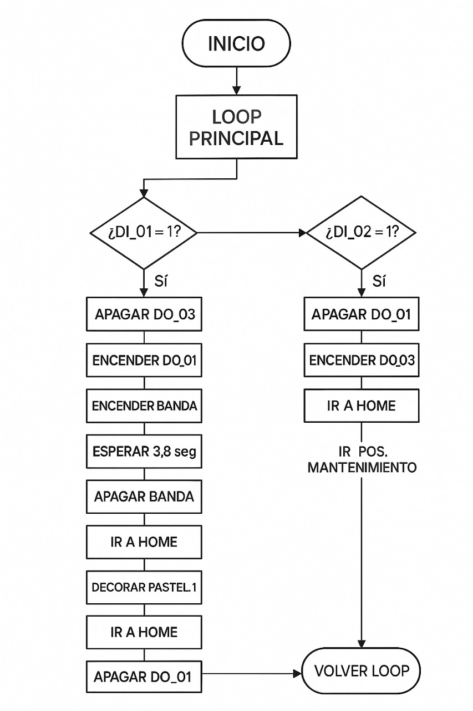
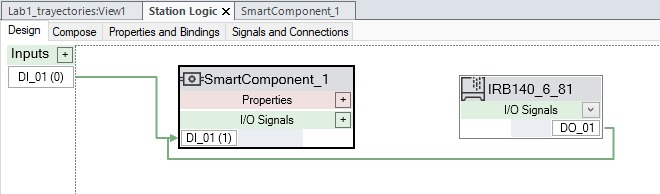
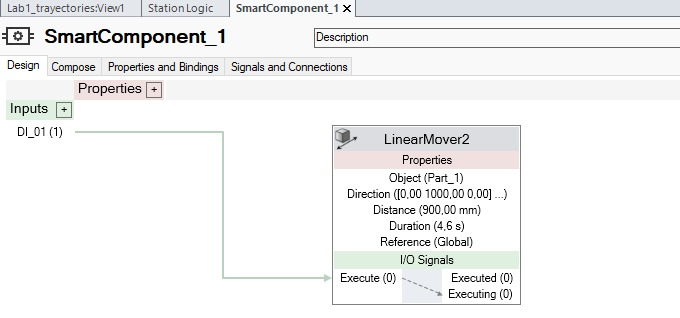

# 🎂 ABB IRB 140 - Emulacion de decorador de Tortas  (Lab 1 - Robótica Industrial)

Este proyecto emula una celda robotizada de decoración de pasteles utilizando un robot *ABB IRB 140. El sistema, desarrollado en **RobotStudio* y ejecutado tanto en simulacion como en el robot real, traza trayectorias que forman nombres y adornos sobre una caja que emula a una torta. En la simulacion se emulo la banda transportadora utilizando un linear smart component, mientras que en el laboratorio LABSIR de la UNAL bogota se utilizaron bandas y logica cableada real.

---
## Integrantes
### Sergio Felipe Rodriguez Mayorga - Ingeniería Mecatrónica [GitHub](https://github.com/sfrodriguezma)
### Sergio Andrés Bolaños Penagos - Ingeniería Mecatrónica - [GitHub](https://github.com/sergiosinlimites)

## 📦 Requisitos

* RobotStudio (v5 o superior)
* Controlador IRC5 con módulo DSQC652
* Herramienta física (marcador montado)
* Software CAD para generar archivo .SAT
* Robot ABB IRB 140 y banco de trabajo.
* Memoria USB y/o cable Ethernet RJ-45.

---

## 🧁 Descripción del Laboratorio

### Objetivo

Simular la decoración de una torta para 20 personas escribiendo los *nombres de los integrantes del equipo* y una *decoración libre*, respetando restricciones de zona, velocidad y trayectoria.

### Restricciones técnicas

* Velocidades entre v100 y v1000
* Tolerancia de zona: z10
* Movimiento continuo desde y hacia la posición Home
* Implementacion de dos entradas digitales conectadas a pulsadores que permitan controlar la rutina de decoracion del pastel y el desplazamiento del robot a una zona de mantenimiento y/o cambio de herramienta
* Implementacion de 2 salidas digitales, una para activar un piloto cuando se esta en la rutina de decoracion, y otra para activar o desactivar la banda transportadora.
* Decoración sobre cuadrantes x(+), y(+), y su espejo x(+), y(–) cambiando solo el Work object.

## 🛠 Herramienta Personalizada

Se diseñó una herramienta que permite sujetar un plumón al flanche del robot, para lo cual se uso el software Fusion 360.

Figura: Modelo CAD de la herramienta diseñada para contener el marcador. Se observan el ángulo de inclinación de 30 grados y la terminación con la forma del marcador.

Se puede ver la herramienta montada en el flanche de la simulación en la siguiente imagen:

Figura: Herramienta personalizada montada sobre el ABB IRB 140. Se muestran los ejes del TCP y su orientación.

## 🎥 Calibración de herramienta (TCP)
Para calibrar la herramienta se utilizó el método de cuatro puntos, mediante el cual se determinó la posición del punto central de la herramienta (TCP). El proceso arrojó un error medio de 2,42 mm en la calibración con un mínimo de 1.51 mm y un máximo de 3.40 mm.

<video width="1080" height="720" controls>
  <source src="assets/video/calibracion-tcp.mp4" type="video/mp4">
  Tu navegador no soporta video HTML5.
</video>

[Si no puedes ver el video haz click aquí -> Calibración TCP](assets/video/calibracion-tcp.mp4)

---

 

## 🗺 WorkObject y Escenario

Se definió un WorkObject con referencia al plano del pastel, permitiendo replicar las trayectorias en dos cuadrantes:

* Cuadrante principal: x(+), y(+)
* Cuadrante reflejado: x(+), y(–)

El pastel tiene unas medidas de 370 mm x 155 mm x 40 mm

---

## 🗺 Plano de planta

A continuación se presenta una vista desde arriba (top view) de la celda robótica. Se observan claramente el robot ABB IRB 140, la banda transportadora, la ubicación del pastel (la caja) y las trayectorias en el punto al que llega el pastel.

Figura: Plano de planta de la celda. Se muestra la ubicación del robot, el pastel, y las trayectorias de trabajo.

---

## ✏ Diseño de Trayectorias

Se crearon trayectorias para:

* *Nombres del equipo:* Sergio en los dos casos
* *Decoración libre:* para lo cual se dibujo una estrella.

Figura: Diseño en CAD del texto "SERGIO", con todas las letras unidas por la parte superior, de esta forma no se levanta tantas veces el marcador.

Figura: Diseño en CAD de la estrella como decoración libre.

Figura: Vista general de las trayectorias para letras y adorno con targets asignados.

---

## 💻 Código RAPID

El siguiente fragmento muestra cómo se ejecuta la rutina desde main():

rapid
PROC main()
        WHILE TRUE DO
            !---------Cake decoration Routine-----------
            IF DI_01=1 THEN
                Reset DO_03;
                Set DO_01;
                set Conveyor_FWD;
                WaitTime 3.8;
                Reset Conveyor_FWD;
                Path_Home;
                Routine_cake1;
                Path_Home;
                Routine_cake2; 
                Path_Home;
                Reset DO_01;
            ENDIF
            !----------Change tool position Routine/Maintenance ----------------
            IF DI_02=1 THEN
                Reset DO_01;
                Set DO_03;
                Path_Home;
                Path_maintenance;
            ENDIF
            
         ENDWHILE
    ENDPROC

Este codigo como se aprecia en los respectivos comentarios tiene 2 rutinas de pastel, en donde la del pastel 1 es la que se realiza sobre la banda transpostadora, y el pastel 2 es el que esta en otro cuadrante y para el cual solo se define otro work object y se reutiliza la respectiva rutina, por otro lado se tiene la rutina de mantenimiento. (todo esto se aprecia mucho mejor en el video explicativo de la simulación).
 
### 🔍 Descripción de funciones RAPID utilizadas

* **main()**: bucle principal que espera una señal digital de entrada para su activacion.
* *` Routine_cake1`* y * *` Routine_cake2`*: Realiza el llamado a las respetivas trayectorias para decoración del pastel.
* * **Path_maintenance**: Realiza el llamado a la rutina de mantenimiento.
* Se usan señales de entrada digitales(` DI_01`, ` DI_02`), las cuales están conectadas a pulsadores en la realidad y activan la rutina de decoracion de pasteles y de mantenimiento, respectivamente.
* Se usan señales de salida digitales (DO_01`, DO_02 y Conveyor_FWD), las dos primeras estan conectadas a pilotos para verificacion visual, mientras que la ultima es la que esta conectada a la banda transportadora.

---

## 🧪 Resultados

El resultado obtenido a partir de todo el procedimiento previo, utilizando el robot real del laboratorio, es el siguiente:

<video width="1080" height="720" controls>
  <source src="assets/video/resultado-final.mp4" type="video/mp4">
  Tu navegador no soporta video HTML5.
</video>

[Si no puedes ver el video haz click aquí -> Resultado final](assets/video/resultado-final.mp4)

Adicionalmente, se realiza la misma prueba a la máxima velocidad permitida utilizando el botón de hombre muerto, la cual es de 300mm/s.

<video width="1080" height="720" controls>
  <source src="assets/video/resultado-rapido.mp4" type="video/mp4">
  Tu navegador no soporta video HTML5.
</video>

[Si no puedes ver el video haz click aquí -> Resultado a máxima velocidad](assets/video/resultado-rapido.mp4)

 ## 🔄 Diagrama de Flujo de Acciones del Robot

Figura: Diagrama de flujo de las acciones del robot

A continuación se muestra el diagrama de la estación así como el Smart Component utilizado en la simulación.
La estación se encarga de conectar la salida DO_01 a la entrada del Smart Component, y el Smart Component utiliza el component LinearMover2, que permite definir una distancia desde el punto inicial (borde de la banda) y un tiempo para llegar a esa distancia. Se definió una distancia de 900 mm a partir del borde de la banda transportadora como punto de llegada para que el robot dibujara.

*Figura: Lógica de la estación, en ella se puede ver el Smart Component conectado a la salida DO_01.

Figura: Diagrama del Smart Component, se utiliza un LinearMover2 que permite asignar una distancia y un tiempo específico al ejecutar.

<video width="1080" height="720" controls>
  <source src="assets/video/explicacion_simulacion.mp4" type="video/mp4">
  Tu navegador no soporta video HTML5.
</video>

[Si no puedes ver el video haz click aquí -> Resultado a máxima velocidad](assets/video/explicacion_simulacion.mp4)

## 📌 Conclusiones

* Se aplicaron conceptos de espacio de trabajo del robot, Tool Central Point (TCP) y WorkObject para trasladar trayectorias entre cuadrantes.
* Es importante tener en cuenta posibles casos de falla para realizar los modelos de la herramienta, así como para configurar los parámetros de impresión, eligiendo opciones más resistentes que promuevan que la distribución interna del material tienda a ser isotrópica, permitiendole resistir esfuerzos en múltiples direcciones.
* Se logró una calibración aceptable del TCP, la cual permitió un dibujo prolijo a nivel general, sin embargo debido a inclinaciones de la banda transportadora, en una zona se realizaba el trazo de manera muy leve.
* El uso del Smart Component LinearMover2, permitió una simulación fluida y sencilla de implementar.
* El uso de la simulación de RobotStudio permitió anticiparse a errores, y ayudó al rapido y correcto desarrollo de las rutinas que después se realizarían con el robot real.
* La experiencia reforzó habilidades en modelado, simulación, programación en RAPID y manejo de robot industriales.

---

## 📂 Archivos del Proyecto

El proyecto completo está organizado en las siguientes carpetas y archivos:

| Archivo/Carpeta         | Descripción                                                |
| ----------------------- | ---------------------------------------------------------- |
| Lab1_trayectories - Linear_smart_component | Proyecto completo de RobotStudio |
| assets         |  Carpeta con archivos .sat de la herramienta, nombres; dibujos, con sus diferentes versiones debido a inconvenientes con las primeras versiones; y módulos de rapid del Wobj, TCP  |
| assets/video/               | Carpeta con videos de simulación, ejecución y calibración  |
| assets/img/             | Carpeta con capturas de pantalla de simulación y resultados de calibración  |

---

## 🔗 Referencias

* [ABB RAPID Language Manual](https://library.abb.com/)
* [RobotStudio Online Help](https://developercenter.robotstudio.com/)
* [LabSIR - Universidad Nacional](https://labsir.unal.edu.co/)